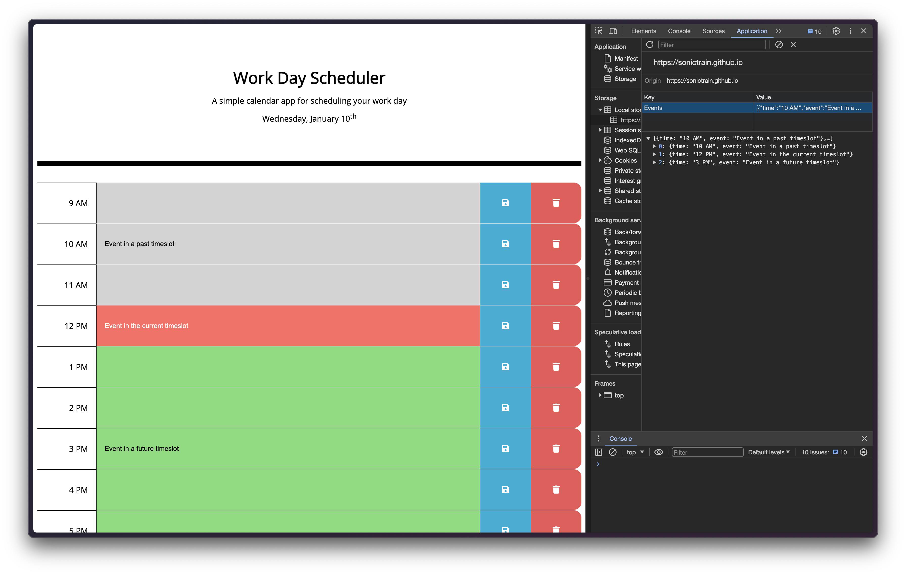

# workday-scheduler-online
[](https://www.javascript.com) 

Live prototype hosted on Github Pages: https://sonictrain.github.io/workday-scheduler-online/

## Table of Contents 
- [Preview](#Preview)
- [Description](#Description)
- [Features](#Features)
- [Technologies](#Technologies)
- [Usage](#Usage)
- [Credits](#Credits)
- [License](#License)

## Preview


## Description
The Interactive Work Day Scheduler is a web-based application designed to assist users in managing their daily schedules efficiently. The application allows users to add, remove, save, and delete events within 1-hour time slots. The use of JavaScript (JS) and jQuery enhances the interactivity and responsiveness of the scheduler.

## Features
- User-Friendly Interface: The scheduler provides an intuitive and easy-to-use interface for users to manage their daily tasks.
- Hourly Time Slots: The scheduler divides the day into 1-hour time slots, providing a granular view of the work day.
- Add and Remove Events: Users can easily add new events to specific time slots by clicking on the desired hour. Events can be removed with a simple click as well.
- Save and Delete Buttons: Users can save the entered event details by clicking the "Save" button associated with each time slot. A "Delete" button is provided to remove an event from the schedule.
- Local Storage Integration: The application utilizes the local storage of the user's browser to persistently store the scheduled events. Events are saved in the local storage along with their associated time slots and descriptions, ensuring data persistence across page refreshes.

## Technologies
- HTML5 for the structure.
- CSS3 for styling and layout.
- JavaScript for dynamic interaction and event handling.
- jQuery library for simplified DOM manipulation.
- Local Storage: Utilizes the browser's local storage API to store and retrieve event data persistently.

## Usage
Simply clone the repo using the following command:
```
git clone <repository-address>
```

cd inside the the repository on your local machine:
```
cd workday-scheduler-online
```

and finally launch the `index.html` file with a browser of your choice.
Alternatively feel free to visit the web app from [this link](https://sonictrain.github.io/workday-scheduler-online/).

## Credits
- [Shield.io](https://shields.io/) for their awesome badges!

## License
[](https://github.com/Naereen/StrapDown.js/blob/master/LICENSE)

Copyright (c) Nicola Brucoli. All rights reserved.
Licensed under the [MIT](./LICENSE) license.
